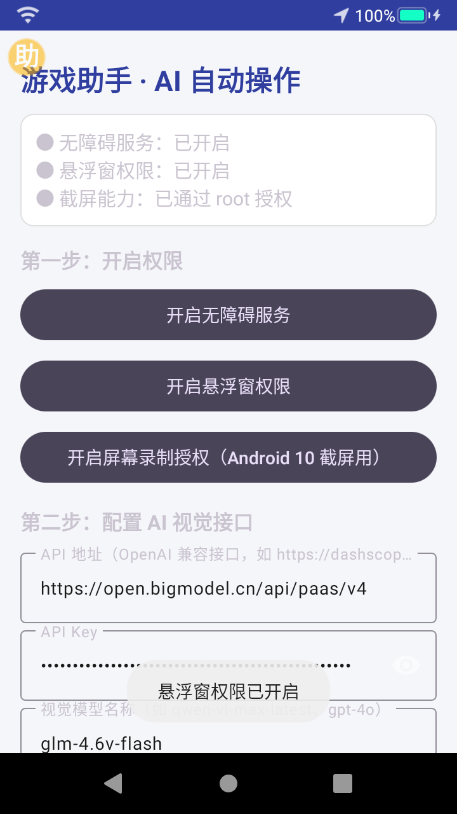
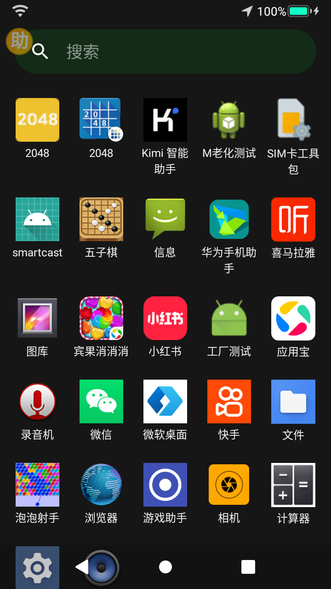

# GameMaster · AI Phone Task Assistant

> A vision-model-driven Android automation assistant — describe a task in one sentence, and it observes the screen, breaks the task into steps, and performs taps, swipes, and text input until the job is done.

视觉大模型驱动的 Android 自动化助手。[中文文档](README.zh-CN.md)

---

## ✨ Features

### 🤖 General-Purpose Task Execution
- **Natural language tasks**: Type things like "open the calculator", "download Xiaohongshu", or "search for Honor of Kings in the app store" — fully automated.
- **Task planning**: The vision model first decomposes the task into an ordered step-by-step plan with per-step verification signals, then executes them one by one.
- **Broad applicability**: Launch apps, search, download & install, play games, routine UI operations, and more.

### 🛡️ Anti-Loop Mechanism (the core)
- **Semantic loop detection**: Beyond catching "repeated taps at the same coordinates", it recognizes semantic dead loops such as "doing the same ineffective thing at different positions" and "bouncing back and forth between two screens".
- **Escalating self-recovery**: When stuck, it rescues itself in escalating stages — press Back → replan from the current screen → switch to a fallback vision model → restart the app.
- **On-screen replanning**: When the original plan doesn't work, it captures the current real screen and asks the model to decompose a new plan from there.
- **Watchdog stop**: If multiple replans still make no progress, it stops with a clear error instead of spinning forever and burning API tokens.

### ✅ Evidence-Based Completion Gate
- **Independent visual verification**: Before finishing, a separate vision check must confirm the target evidence is visible on screen — no more "fake completion".
- **Deterministic checks**: "Open an app" tasks are verified against the foreground package name as hard evidence, without relying on the vision model.
- **Plan progress check**: `finish` is rejected until every planned step is completed.

### 🧰 Python Tool System
- **Chaquopy integration**: Python 3.9 runtime embedded in-app, no external Python required.
- **Built-in tools**: `web_search` (Bing), `web_read` (URL fetcher), `apk_install` (download & pm install), `file_ops` (file operations).
- **Tool-aware prompting**: The system prompt dynamically lists available tools with JSON call examples; the planner routes information-seeking tasks to `tool_call` instead of opening a browser.
- **Auto step advancement**: After a successful tool call, `plan_step` auto-advances so weak models don't get stuck repeatedly calling the same tool.

### 🔧 System-Hosted Capabilities
- **Search hosting**: Automatically identifies the search box, enters the keyword, and submits — working around self-drawn fake search boxes and clipboard restrictions.
- **Download hosting**: For download tasks, it takes over the app-store flow — search, APK download detection, and `pm install`.
- **Package name mapping**: Built-in mapping for common apps.

### 🎮 Game-Specific Optimizations
- **Dead-swipe redirection**: In merge games like 2048, when the model's chosen swipe direction has no effect, the system automatically tries another direction.
- **Restart detection**: Automatically recognizes and taps the "play again" button when a game ends.

### 🔌 Backend Abstraction Layer
- **Multi-backend support**: `RootBackend` (priority 10) > `ShizukuBackend` (8) > `AccessibilityBackend` (1) — automatically selects the best available backend.
- **Shizuku support**: Execute shell commands via Shizuku without root, using reflection to access the private `binder` field.
- **Unified API**: `BackendSelector.best()` returns the best backend; `bestForShell()` returns Root or Shizuku for shell commands.

---

## 📸 Screenshots

| Main UI (configuration) | App drawer + floating ball |
|:---:|:---:|
|  |  |

---

## 🔧 Installation

### Requirements
- Android 10 (API 29) or higher
- Root access recommended (for screenshots and shell commands); non-root devices can use Shizuku or the screen-recording grant instead
- Android Studio / JDK 11+ if building from source

### Option 1: Build from source

```bash
# 1. Clone the repository
git clone https://github.com/moon-sky/gamemaster.git
cd gamemaster

# 2. Configure your SDK path (edit local.properties)
echo "sdk.dir=/path/to/your/android-sdk" > local.properties

# 3. Build the debug APK
./gradlew :app:assembleDebug

# 4. Install on your device
adb install -r app/build/outputs/apk/debug/app-debug.apk
```

### Option 2: Pre-built APK
Download the APK from [Releases](../../releases) and install it directly.

### First-time setup

1. **Grant permissions** (tap each button in the app):
   - Accessibility Service (required — reads the UI tree and performs actions)
   - Overlay / Display over other apps (required — the floating control ball)
   - Screen recording grant (for screenshots on Android 10; can be skipped on rooted devices)

2. **Configure the AI vision endpoint**:
   - API Base URL: any OpenAI-compatible vision API (e.g. Zhipu `https://open.bigmodel.cn/api/paas/v4`)
   - API Key: your model service key
   - Vision model name: e.g. `glm-4.6v-flash`, `qwen-vl-max`, etc.

3. **Enter your task** in the input box and press start.

---

## 🏗️ Architecture

```
┌─────────────────────────────────────────────────────────┐
│                      MainActivity                       │  ← task input, model config, permissions
└────────────────────────┬────────────────────────────────┘
                         │
┌────────────────────────▼────────────────────────────────┐
│                GameAccessibilityService                 │  ← UI tree reading, taps/swipes/input
└────────────────────────┬────────────────────────────────┘
                         │
┌────────────────────────▼────────────────────────────────┐
│                     GameAgent                            │  ← main loop: plan → observe → decide → act → verify
│  ┌────────────┐ ┌──────────┐ ┌────────────┐             │
│  │  makePlan  │ │ VisionAPI│ │  HealthCheck│             │  ← planning / vision decision / loop monitor
│  └────────────┘ └──────────┘ └────────────┘             │
│  ┌────────────┐ ┌──────────┐ ┌────────────┐             │
│  │  SystemHost│ │ Evidence │ │  Recovery  │             │  ← system hosting / evidence gate / recovery
│  └────────────┘ └──────────┘ └────────────┘             │
│  ┌────────────┐                                          │
│  │ ToolRegistry│                                         │  ← Python tool calls (web_search, web_read, ...)
│  └────────────┘                                          │
└────────────────────────┬────────────────────────────────┘
                         │
┌────────────────────────▼────────────────────────────────┐
│              BackendSelector (abstraction)               │  ← best() picks Root > Shizuku > Accessibility
│  ┌───────────┐  ┌────────────┐  ┌────────────────────┐  │
│  │ RootBackend│  │ShizukuBackend│  │AccessibilityBackend│  │  ← shell exec / screenshots / pm install
│  └───────────┘  └────────────┘  └────────────────────┘  │
└─────────────────────────────────────────────────────────┘
```

### Core loop
1. **Plan** — the model decomposes the natural-language task into ordered steps (tool-type vs app-type).
2. **Observe** — screenshot plus accessibility tree describe the current screen.
3. **Decide** — the model outputs the next action (tap / swipe / input / back / open app / **tool_call** / finish).
4. **Act** — the accessibility service executes screen actions; ToolRegistry routes `tool_call` to Python tools; BackendSelector picks the best backend for shell commands.
5. **Verify** — check whether the task is complete; if stuck, trigger the recovery mechanism.

---

## 🔐 Privacy & Security

- **Screen data is sent only to the vision API endpoint you configure** — no third-party relay.
- **Your API key is stored locally** in the app's SharedPreferences and is never uploaded elsewhere.
- Accessibility, overlay, and screenshot permissions are used solely for automation.
- We recommend running this on a dedicated test device.

---

## 📄 License

MIT License

---

## 🤝 Contributing

Issues and PRs are welcome!
- For bug reports, please include the device model, Android version, task description, and logs.
- For new features, please open an issue for discussion first.

---

> ⚠️ **Disclaimer**: This tool is intended for learning, research, and legitimate automation testing only. Do not use it in ways that violate any application's terms of service.
